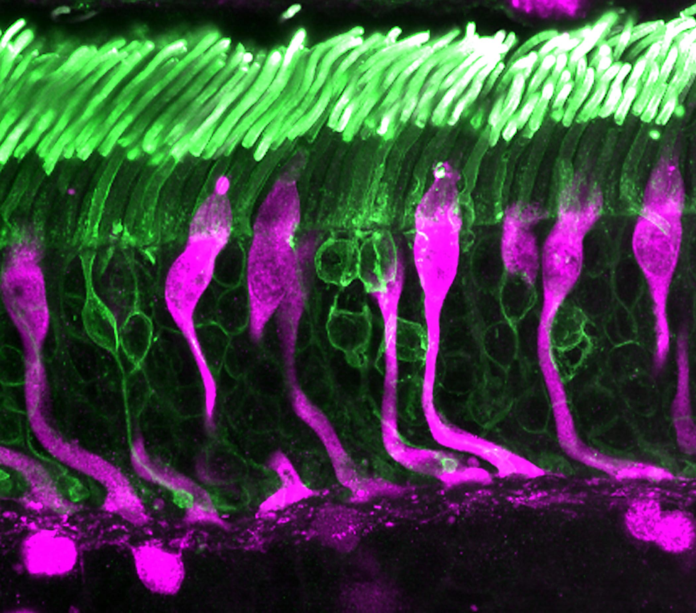

# RGBtoRGM
Author: Umesh Mohan (umesh@heterorrhina.in)

Convert an RGB image into RGM (magenta) image for 
red-green colorblind people to distinguish with the help of blue hue. 

This program computes magenta "channel" by adding red and blue channels. The original blue channel is then replaced with this computed magenta channel.

## Usage
`RGBtoRGM.py [-h] [-o OUTPUT] input_image`

## Example
`RGBtoRGM.py test.jpg`
### test.jpg

### test.RGM.jpg

Test image from https://www.flickr.com/photos/nationaleyeinstitute/24912842829